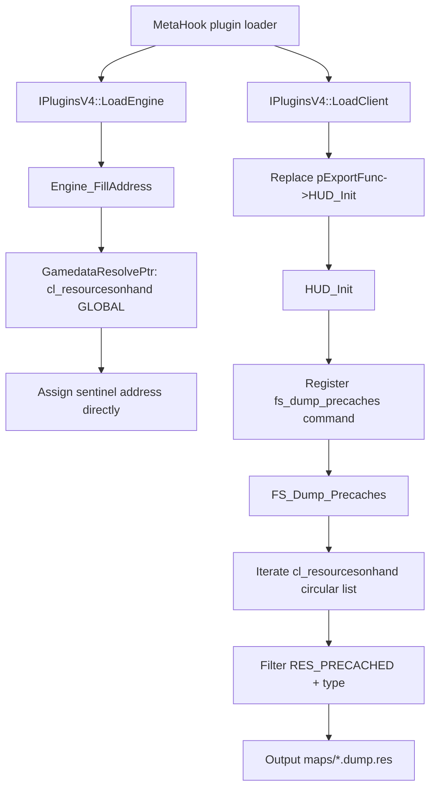

# PrecacheManager

PrecacheManager is a MetaHookSv utility plugin that dumps the current map's precached resource list.
After client initialization it registers the `fs_dump_precaches` console command, which exports the
engine's `cl_resourcesonhand` list to `<mapname>.dump.res` next to the map.

## Provenance

This repository is the standalone PrecacheManager plugin, extracted from MetaHookSv
(`Plugins/PrecacheManager/`) into its own CMake workspace, aligned with the standalone HeapPatch and
VGUI2Extension projects. This note was migrated from MetaHookSv `memory/PrecacheManager.md` and
adapted to the new layout: plugin sources moved to `src/`, and the original MSBuild / `plugins_*.lst`
integration was replaced by CMake plus a self-owned gamedata catalog. The `metahooksv` Basic Memory
project belongs to the source repository; notes here use the `precachemanager` project and the
`precachemanager/` permalink prefix.

## Responsibilities and entry points

- `src/plugins.cpp`: `IPluginsV4` lifecycle. `LoadEngine` collects the file-system interface
  (`FileSystem` or `FileSystem_HL25`), engine type/buildnum and engine image base, copies
  `cl_enginefunc_t`, then calls `Engine_FillAddress`. `LoadClient` takes over `pExportFunc->HUD_Init`.
- `src/privatehook.cpp`: gamedata address resolution. `GamedataResolvePtr` wraps
  `g_pMetaHookAPI->ResolveGameSymbol`; `Engine_FillAddress_CL_ResourceOnHand` resolves the engine
  global `cl_resourcesonhand` as the list sentinel and assigns it directly to the plugin variable.
- `src/exportfuncs.cpp`: `FS_Dump_Precaches` and `HUD_Init`. Defines `cl_resourcesonhand`, registers
  the `fs_dump_precaches` command and writes the dump file.
- `src/privatehook.h`: `resource_t` / `resourcetype_t` layout, the `cl_resourcesonhand` declaration
  and the `private_funcs_t` template.
- `scripts/manifests/precachemanager.json`: the single gamedata symbol this plugin consumes
  (`engine` / `cl_resourcesonhand` / `global`) plus the supported game-version list.

## Repository layout

- `src/plugins.cpp`, `src/plugins.h` — plugin lifecycle and shared globals.
- `src/privatehook.cpp`, `src/privatehook.h` — gamedata resolution and resource type definitions.
- `src/exportfuncs.cpp`, `src/exportfuncs.h` — command registration and dump implementation.
- `CMakeLists.txt`, `cmake/Sources.cmake`, `cmake/Dependencies.cmake`, `cmake/VCLTL.cmake` — build.
- `scripts/build-PrecacheManager-x86-{Debug,Release}.bat` — configure/build/install entry points.
- `scripts/manifests/precachemanager.json`, `scripts/sync-gamedata.py`, `scripts/validate-gamedata.py`
  — gamedata synchronization and validation.
- `README.md`, `README.zh-CN.md` — install, command and build documentation.

## Architecture

The core consists of three stages:

1. **Plugin lifecycle integration** (`src/plugins.cpp`): `LoadEngine` gathers engine/file-system
   context and resolves addresses; `LoadClient` takes over `HUD_Init`.
2. **Address-resolution layer** (`src/privatehook.cpp`): resolves the gamedata GLOBAL
   `cl_resourcesonhand` once against the real engine base and assigns the returned sentinel address
   directly to the plugin variable; failure is fatal.
3. **Command-execution layer** (`src/exportfuncs.cpp`): `HUD_Init` registers the command, while
   `FS_Dump_Precaches` iterates the circular doubly linked resource list and exports the file.

## Dependencies

- **MetaHook API** (>= 109, enforced by a `static_assert` in `src/privatehook.cpp`):
  `ResolveGameSymbol`, `GetModuleCRC64`, `GetGameSymbolStatusString`, `GetEngineType`,
  `GetEngineBuildnum`, `GetEngineBase`, and `SysError`.
- **Engine export table**: `cl_enginefunc_t` (`pfnGetLevelName`, `pfnAddCommand`, and `Con_Printf`).
- **File-system abstraction**: `IFileSystem` / `IFileSystem_HL25`, invoked uniformly through the
  `FILESYSTEM_ANY_OPEN` / `FILESYSTEM_ANY_WRITE` / `FILESYSTEM_ANY_CLOSE` macros.
- **Resource flags/types**: `RES_PRECACHED`, plus the plugin-defined `resourcetype_t` and `resource_t`.
- **MetaHook SDK headers**: consumed, not built — from `METAHOOK_SOURCE_PATH` or a pinned
  FetchContent checkout.

## Build and data flow

`scripts/build-PrecacheManager-x86-{Debug,Release}.bat` → CMake (Visual Studio 17 2022, `-A Win32`) →
compile the DLL → install.
The build uses MSVC x86 / C++20, a static CRT and VC-LTL 5.3.1, with the explicit compile list in
`cmake/Sources.cmake`; the plugin links no third-party library.
`scripts/manifests/precachemanager.json` → `scripts/sync-gamedata.py` → pruned catalog under
`build/x86/<Configuration>/assets/svencoop/metahook/gamedata/precachemanager`, checked by
`scripts/validate-gamedata.py` (which the build depends on; disable with
`-DPRECACHEMANAGER_SYNC_GAMEDATA=OFF`).
Install output is `install/x86/<Configuration>/svencoop/metahook/{plugins,gamedata/precachemanager}`;
nothing is deployed into the game automatically. CI runs `.github/workflows/livebuild.yml` and
`release.yml` through `.github/actions/build-windows-x86/action.yml`.

## Notes

- `FS_Dump_Precaches` exports only `t_sound`, `t_model` (excluding names that begin with `*`) and
  `t_generic`; decal, eventscript and world are not exported.
- Iteration depends on `cl_resourcesonhand` resolving; a missing gamedata record or resolve failure
  triggers `Sys_Error` at load time with symbol, module, engine buildnum and CRC64 diagnostics instead
  of leaving the pointer null.
- The resolved global address is the list sentinel itself, so the walk starts at `->pNext` and stops
  when it returns to the sentinel — no extra dereference.
- The export-file naming logic removes the last four characters from the map name and appends
  `.dump.res`, implicitly assuming a `.bsp` map-name suffix.
- Sven Co-op sound resources are also affected by the `soundcache.txt` mechanism, so the export list
  does not necessarily cover all sound assets (as documented in `README.md` / `README.zh-CN.md`).
- `private_funcs_t` / `gPrivateFuncs` and the hook macros in `src/plugins.h` do not form a complete
  hook-installation path in the current version; they are retained as templated capability.

## Callers (optional)

- The MetaHook plugin framework drives the `Init` / `LoadEngine` / `LoadClient` / `ExitGame` lifecycle
  through `EXPOSE_SINGLE_INTERFACE(..., METAHOOK_PLUGIN_API_VERSION_V4)`.
- The console command system calls `FS_Dump_Precaches` when the user runs `fs_dump_precaches`.
- The host launcher loads `metahook/plugins/PrecacheManager.dll` from `plugins.lst` and merges
  `metahook/gamedata/precachemanager` into its gamedata catalog.

## External documentation

`README.md` is the English landing page and `README.zh-CN.md` the Chinese one; together they cover
install, the `fs_dump_precaches` command and the build.
